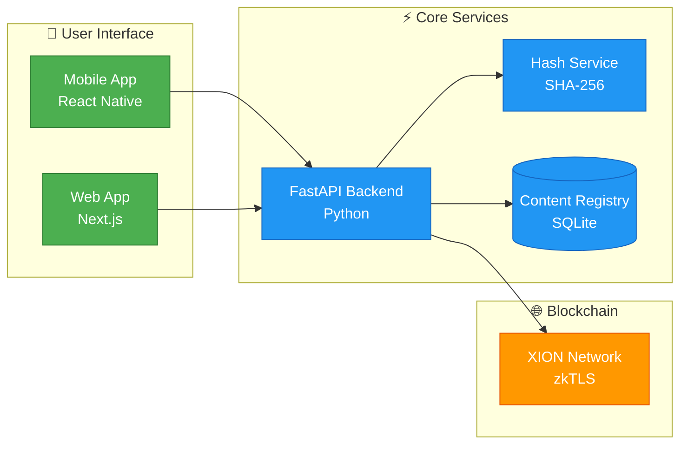
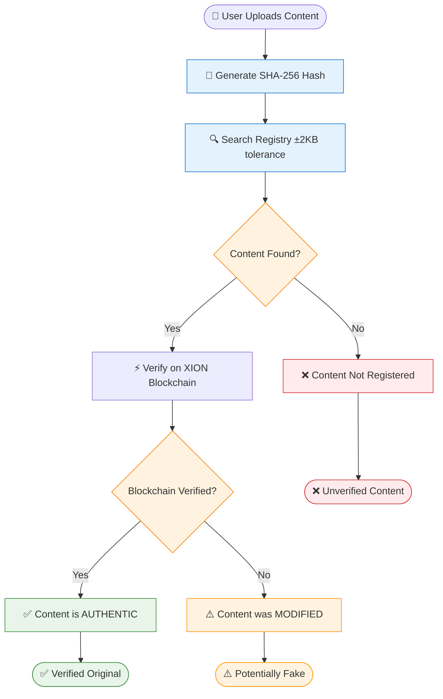

# 🎯 NoirCheck - Architecture Overview for Hackathon

## 📊 **SIMPLE SYSTEM ARCHITECTURE**

---

## 🔄 **VERIFICATION PROCESS FLOW**

---

## 🛠️ **KEY TECHNOLOGIES**

| Component | Technology | Purpose |
|-----------|------------|---------|
| 📱 **Mobile** | React Native + Expo | Cross-platform app with camera |
| 🌐 **Web** | Next.js + React | Browser-based interface |
| 🚀 **Backend** | FastAPI (Python) | REST API server |
| 💾 **Database** | SQLite | Content registry storage |
| ⛓️ **Blockchain** | XION Testnet | Decentralized verification |
| 🔐 **Security** | SHA-256 Hashing | Content fingerprinting |

---

## 🎯 **CORE FEATURES**

### 📸 **Content Registration**
- Upload original photos/videos
- Generate unique SHA-256 hash
- Store on local registry + blockchain
- Get registration confirmation

### ✅ **Content Verification**  
- Upload any file to check authenticity
- Compare against registered content
- ±2KB tolerance for compression differences
- Show verification result with confidence score

### 🔍 **Smart Detection**
- **Exact Match**: 100% confidence (same file)
- **Minor Changes**: 85-99% (compression/metadata)  
- **Modified Content**: 0-50% (edited/fake)
- **Unknown Content**: 0% (not registered)

---

## 📱 **MOBILE APP SCREENS**

1. **📸 Registration Tab**
   - Camera integration
   - Gallery selection
   - Upload progress
   - Success confirmation

2. **✅ Verification Tab**
   - File picker
   - Hash calculation
   - Result display
   - Confidence scoring

3. **📊 History Tab**
   - Registration history
   - Verification logs
   - Statistics dashboard

---

## 🏆 **HACKATHON VALUE PROPOSITION**

### **Problem Solved**: Digital content misinformation and deep fakes
### **Solution**: Blockchain-based content authenticity verification
### **Innovation**: Mobile-first approach with tolerance-based matching
### **Impact**: Empowers users to verify content authenticity instantly

### **Technical Highlights**:
- ✅ Real blockchain integration (XION testnet)
- ✅ Cross-platform mobile application  
- ✅ Advanced hash-based verification
- ✅ Offline-capable local registry
- ✅ Professional UI/UX design

---

## 📋 **DEMO SCRIPT** (3 minutes)

1. **[0-30s]** Problem Introduction + Architecture Overview
2. **[30s-1:30]** Live Demo: Register original content
3. **[1:30-2:30]** Live Demo: Verify same content (✅ Authentic)
4. **[2:30-3:00]** Live Demo: Verify modified content (⚠️ Fake) + Conclusion

---

## 🚀 **DEPLOYMENT STATUS**

- ✅ **Mobile App**: Expo development build ready
- ✅ **Backend API**: Local development server
- ⏳ **Web App**: Next.js deployment pending
- ⏳ **Production**: Railway/Vercel deployment in progress

---

**Project**: NoirCheck - Digital Content Authenticity Verification
**Team**: Solo Developer
**Timeline**: 48 hours hackathon
**Tech Stack**: React Native, FastAPI, XION Blockchain
