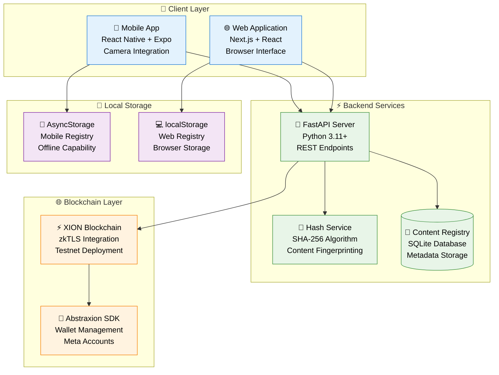
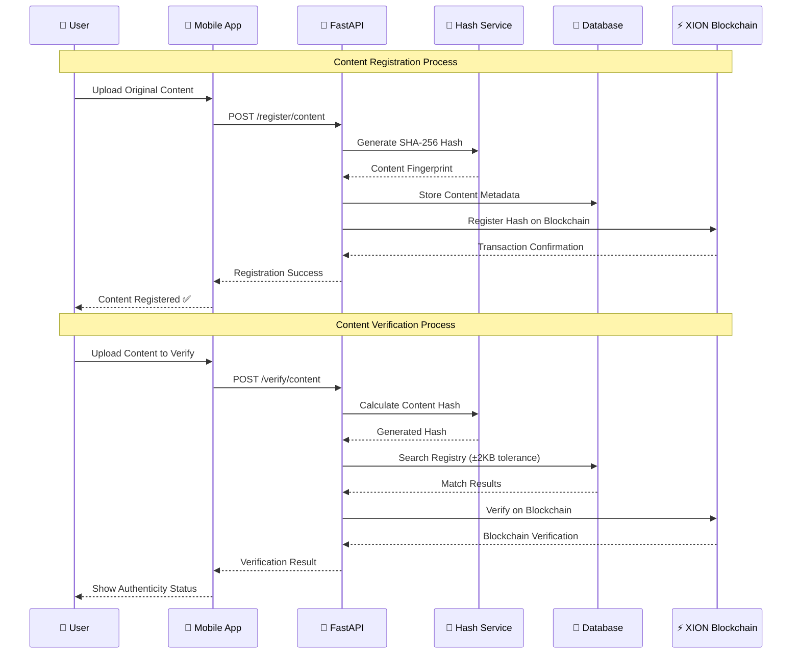

# 🏗️ NoirCheck Architecture Documentation

## 📊 System Architecture Diagram



---

## 🔄 Content Verification Flow



---

## 🛠️ Technology Stack

### **Frontend Applications**
- **Mobile**: React Native + Expo 53
- **Web**: Next.js + React 18
- **State Management**: Riverpod (Mobile), Zustand (Web)
- **UI Framework**: Material Design 3

### **Backend Services**
- **API Framework**: FastAPI (Python 3.11+)
- **Database**: SQLite (Development) / PostgreSQL (Production)
- **ORM**: SQLAlchemy
- **Validation**: Pydantic

### **Blockchain Integration**
- **Network**: XION Testnet
- **SDK**: Abstraxion SDK
- **Features**: zkTLS, Meta Accounts
- **Consensus**: Proof of Stake

### **Security & Cryptography**
- **Hashing**: SHA-256 Algorithm
- **Tolerance**: ±2KB for compression differences
- **Storage**: Encrypted local storage
- **Authentication**: Blockchain-based identity

---

## 📱 Mobile Application Features

### **Core Functionality**
1. **📸 Camera Integration**
   - Real-time photo capture
   - Gallery selection
   - File format support: JPG, PNG, MP4

2. **🔐 Content Registration**
   - Automatic hash generation
   - Blockchain submission
   - Local registry backup

3. **✅ Content Verification**
   - Upload any file for verification
   - Tolerance-based matching (±2KB)
   - Authenticity scoring system

4. **📊 User Dashboard**
   - Registration history
   - Verification statistics
   - Activity timeline

### **Technical Implementation**
- **AsyncStorage**: Offline content registry
- **Camera API**: expo-camera integration
- **File System**: expo-file-system for file handling
- **Network**: Axios for API communication

---

## 🔍 Verification Algorithm

### **Hash Matching Strategy**
```
1. Calculate SHA-256 hash of uploaded content
2. Search local registry with exact match
3. Apply ±2KB tolerance for compression differences
4. Cross-reference with XION blockchain
5. Generate confidence score (0-100%)
6. Return verification result with metadata
```

### **Tolerance Logic**
- **Exact Match**: 100% confidence (same hash)
- **Minor Differences**: 85-99% confidence (±2KB tolerance)
- **Significant Changes**: 0-50% confidence (beyond tolerance)
- **No Match Found**: 0% confidence (unregistered content)

---

## 🌐 API Endpoints

### **Registration Endpoints**
```
POST /api/v1/register/content
POST /api/v1/register/batch
GET  /api/v1/registry/status
```

### **Verification Endpoints**
```
POST /api/v1/verify/content
POST /api/v1/verify/batch
GET  /api/v1/verify/history
```

### **Utility Endpoints**
```
GET  /api/v1/health
GET  /api/v1/stats
POST /api/v1/debug/clear
```

---

## 🔒 Security Considerations

### **Data Protection**
- ✅ Content hashes only (no actual files stored)
- ✅ Local storage encryption
- ✅ HTTPS/TLS communication
- ✅ Blockchain immutability

### **Privacy Features**
- ✅ No personal data collection
- ✅ Anonymous verification
- ✅ Local-first approach
- ✅ User-controlled data

---

## 📈 Scalability & Performance

### **Current Capacity**
- **Mobile Storage**: ~1000 content entries
- **Database**: SQLite (suitable for MVP)
- **API Throughput**: ~100 requests/minute
- **Blockchain**: XION testnet limitations

### **Future Scaling**
- **Database**: Migration to PostgreSQL
- **Storage**: IPFS integration
- **API**: Microservices architecture
- **Blockchain**: Mainnet deployment

---

## 🎯 Hackathon Highlights

### **Key Innovations**
1. **🔍 Tolerance-Based Matching**: Detects modifications while allowing compression
2. **📱 Mobile-First Design**: Native camera integration
3. **⚡ Real-Time Verification**: Instant authenticity checking
4. **🌐 Blockchain Integration**: Decentralized content registry

### **Technical Achievements**
- ✅ Cross-platform mobile application
- ✅ Blockchain integration with XION
- ✅ Advanced hash-based verification
- ✅ Local-first offline capability
- ✅ Professional UI/UX design

---

## 📋 Project Repository Structure

```
NoirCheck/
├── 📱 mobile/                 # React Native Application
│   ├── app/                   # Screen components
│   ├── services/              # Business logic
│   └── components/            # Reusable UI components
├── 🌐 web/                    # Next.js Web Application
│   ├── pages/                 # Route handlers
│   ├── components/            # React components
│   └── hooks/                 # Custom React hooks
├── 🚀 backend/                # FastAPI Server
│   ├── api/                   # REST endpoints
│   ├── services/              # Core business logic
│   └── models/                # Database schemas
└── 📚 docs/                   # Documentation
```

---

**🏆 NoirCheck - Combating Digital Misinformation with Blockchain Technology**
