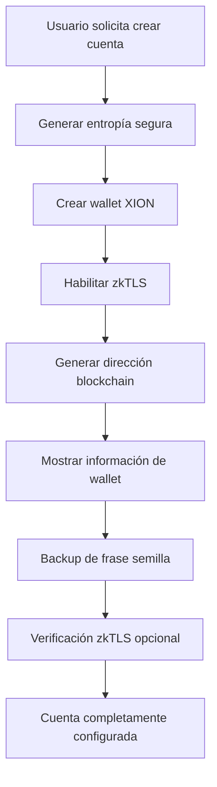

# NoirCheck - Integración Blockchain XION

## Descripción General

NoirCheck utiliza la blockchain XION para proporcionar verificación de autenticidad de contenido digital a través de tecnología zkTLS (Zero-Knowledge Transport Layer Security) y smart contracts.

## Arquitectura de la Integración

### 1. Tecnologías XION Utilizadas

#### **Meta Account Technology**
- Abstracción de cuentas que simplifica la experiencia del usuario
- Eliminación de la complejidad tradicional de manejo de claves privadas
- Integración seamless con aplicaciones web

#### **zkTLS (Zero-Knowledge Transport Layer Security)**
- Verificación de identidad sin revelar información sensible
- Pruebas criptográficas de autenticidad
- Niveles de verificación: `basic`, `enhanced`, `full`

#### **Smart Contracts**
- Registro inmutable de contenido digital
- Verificación descentralizada de autenticidad
- Historial completo de transacciones

### 2. Flujo de Creación de Cuentas



#### **Paso 1: Configuración Inicial**
- El usuario proporciona un nombre de usuario opcional
- Se muestra información de seguridad
- Se explican las características zkTLS

#### **Paso 2: Generación de Wallet**
```typescript
const walletRequest: CreateWalletRequest = {
  username: username || undefined,
  keyType: 'secp256k1',
  zkTLS: true, // Habilitar características zkTLS
  entropy: generateSecureEntropy()
};

const wallet = await xionApiService.createWallet(walletRequest);
```

#### **Paso 3: Información de Wallet Creada**
- **Dirección:** `xion1...` (formato bech32)
- **Clave Pública:** Criptografía secp256k1
- **Frase Semilla:** 12 palabras para backup
- **Estado zkTLS:** Habilitado con verificación pendiente

### 3. Características zkTLS

#### **Niveles de Verificación**
1. **Basic:** Verificación estándar de dirección
2. **Enhanced:** Verificación con pruebas adicionales
3. **Full:** Verificación completa con identidad verificada

#### **Estados de zkTLS**
```typescript
interface ZkTLSStatus {
  enabled: boolean;           // zkTLS habilitado
  proofGenerated: boolean;    // Prueba criptográfica generada
  identityVerified: boolean;  // Identidad verificada
  verificationLevel: 'basic' | 'enhanced' | 'full';
}
```

### 4. Integración con Smart Contracts

#### **Registro de Contenido**
```typescript
// Registrar contenido en blockchain
const registration = await registerContent(file, userAddress);
// Resultado: TX hash, dirección del contrato, metadata
```

#### **Verificación de Contenido**
```typescript
// Verificar autenticidad en blockchain
const verification = await verifyContent(fileHash);
// Resultado: existe, original, nivel de confianza
```

### 5. Configuración de Red

#### **Testnet (Desarrollo)**
```typescript
export const XION_CONFIG = {
  chainId: 'xion-testnet-2',
  rpcUrl: 'https://rpc.xion-testnet-2.burnt.com:443',
  restUrl: 'https://api.xion-testnet-2.burnt.com',
  testnet: true
};
```

#### **Mainnet (Producción)**
```typescript
export const XION_CONFIG = {
  chainId: 'xion-mainnet-1',
  rpcUrl: 'https://rpc.xion-mainnet.burnt.com:443',
  restUrl: 'https://api.xion-mainnet.burnt.com',
  testnet: false
};
```

### 6. APIs Disponibles

#### **XIONApiService**

##### `createWallet(request: CreateWalletRequest)`
Crea una nueva wallet XION con soporte zkTLS
- **Parámetros:** usuario, tipo de clave, entropía, zkTLS
- **Retorna:** Wallet completa con dirección e información zkTLS

##### `completeZkTLSVerification(address: string)`
Completa el proceso de verificación zkTLS
- **Parámetros:** dirección de la wallet
- **Retorna:** estado de verificación y nivel alcanzado

##### `requestFaucetTokens(address: string)`
Solicita tokens de prueba para testnet
- **Parámetros:** dirección de destino
- **Retorna:** éxito y hash de transacción

### 7. Interfaz de Usuario

#### **Componente Principal: XIONWalletCreator**
- Flujo paso a paso para creación de wallet
- Visualización de información de wallet
- Estado en tiempo real de zkTLS
- Acciones rápidas (faucet, verificación)

#### **Elementos Visuales**
- **Dirección de Wallet:** Formato mono-espaciado, copiable
- **Estado zkTLS:** Indicadores visuales de verificación
- **Progreso:** Pasos numerados con estados completados
- **Acciones:** Botones para faucet y verificación

### 8. Seguridad

#### **Generación de Entropía**
```typescript
const generateSecureEntropy = (): string => {
  const array = new Uint8Array(32);
  crypto.getRandomValues(array);
  return Array.from(array, byte => 
    byte.toString(16).padStart(2, '0')
  ).join('');
};
```

#### **Backup de Frase Semilla**
- Mostrar/ocultar con toggle de visibilidad
- Copiar al portapapeles de forma segura
- Descarga como archivo de texto
- Confirmación obligatoria antes de continuar

#### **Validación de Direcciones**
```typescript
const validateAddress = (address: string): boolean => {
  const xionAddressRegex = /^xion[a-z0-9]{39}$/;
  return xionAddressRegex.test(address);
};
```

### 9. Casos de Uso

#### **Registro de Contenido Original**
1. Usuario crea cuenta XION
2. Sube contenido original
3. Sistema calcula hash SHA-256
4. Registra en smart contract con zkTLS
5. Obtiene prueba inmutable de autoría

#### **Verificación de Autenticidad**
1. Usuario o consumidor sube contenido
2. Sistema calcula hash del archivo
3. Consulta blockchain XION
4. Verifica con zkTLS la fuente
5. Proporciona nivel de confianza

#### **Gestión de Identidad**
1. zkTLS verifica identidad sin exponer datos
2. Diferentes niveles de verificación disponibles
3. Pruebas criptográficas reutilizables
4. Privacidad preservada en todo momento

### 10. Próximos Pasos

#### **Funcionalidades Planeadas**
- [ ] Integración completa con mainnet XION
- [ ] Verificación zkTLS de nivel completo
- [ ] Smart contracts personalizados para NoirCheck
- [ ] API de metadatos extendida
- [ ] Soporte para múltiples tipos de contenido
- [ ] Dashboard avanzado de analíticas blockchain

#### **Mejoras de UX**
- [ ] Onboarding interactivo para nuevos usuarios
- [ ] Notificaciones en tiempo real de transacciones
- [ ] Historial detallado de actividad blockchain
- [ ] Integración con wallets externos (Keplr, etc.)

### 11. Recursos Adicionales

- **Documentación XION:** https://docs.xion.io
- **Abstraxion SDK:** https://github.com/burnt-labs/abstraxion
- **zkTLS Specification:** https://docs.xion.io/zktls
- **Smart Contract Examples:** https://github.com/burnt-labs/xion-contracts

---

*Esta documentación se actualiza continuamente conforme evoluciona la integración XION en NoirCheck.*
