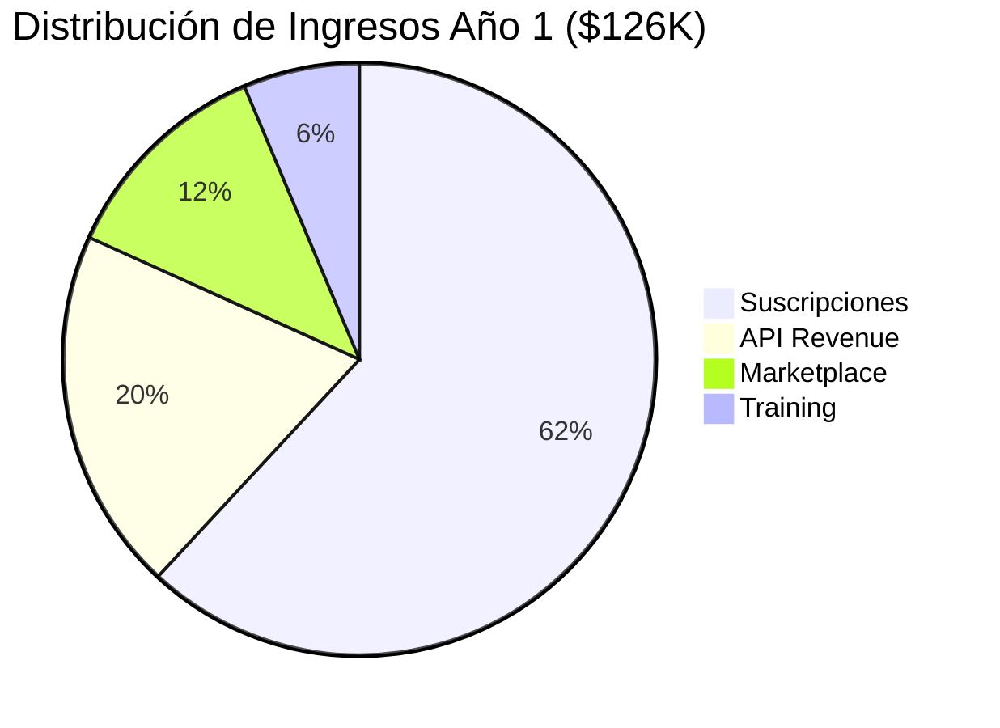
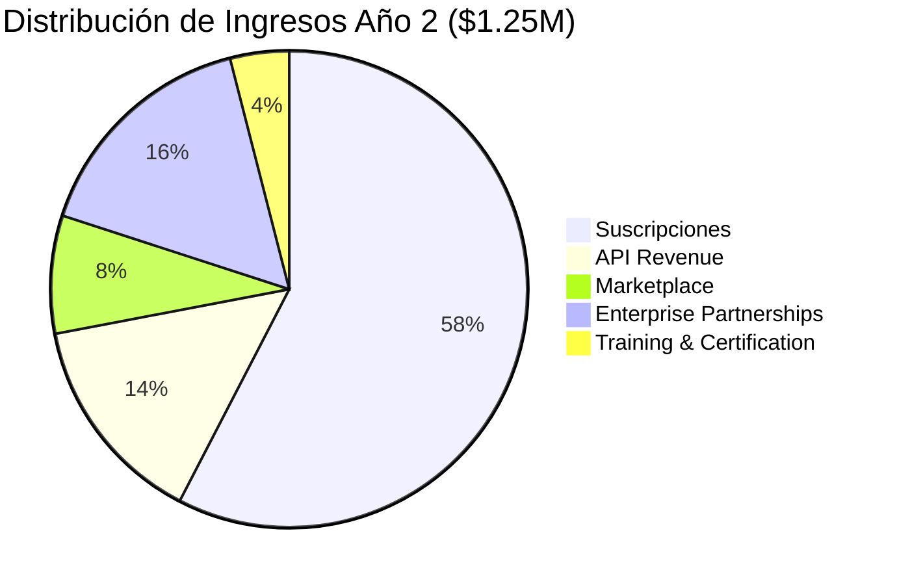
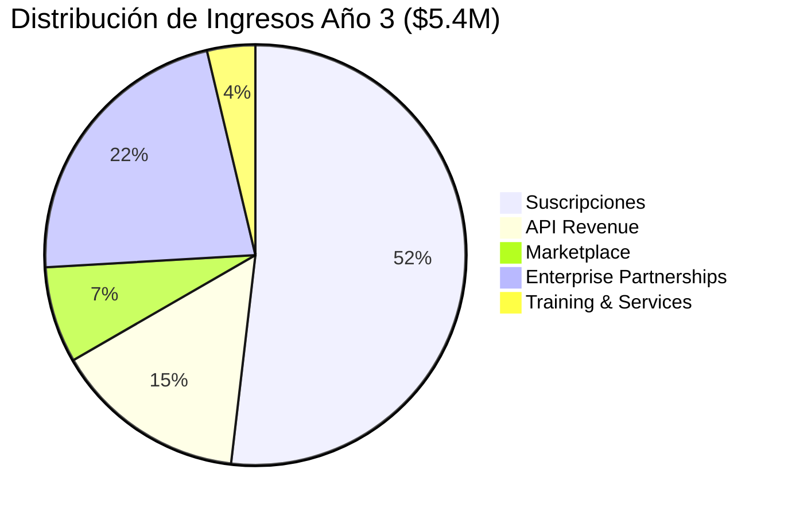

# 💰 NoirCheck Revenue Generation Strategy

<div align="center">


**🚀 Plataforma de Verificación de Autenticidad Digital**


</div>

---

## 📋 Resumen Ejecutivo

NoirCheck es una plataforma innovadora que combate la desinformación digital mediante verificación blockchain. Nuestro modelo de monetización combina **accesibilidad** (tier gratuito) con **crecimiento sostenible** (múltiples flujos de ingresos).

### 🎯 Proyección Financiera Conservadora

| Año | ARR Proyectado | Usuarios Pagos | Clientes Enterprise |
|-----|----------------|----------------|-------------------|
| **Año 1** | `$126K` | 200 | 10 |
| **Año 2** | `$1.25M` | 1,500 | 100 |
| **Año 3** | `$5.4M` | 8,000 | 500 |

---

## 🌟 Flujos de Ingresos Principales

### 💎 1. Modelo de Suscripción SaaS

#### 🆓 **Plan Gratuito** - Community Users
```
✅ 10 verificaciones por mes
✅ Registro básico de contenido (5 items)
✅ Acceso a aplicación web
✅ Soporte comunitario
```

#### 🥉 **Creator Pro** - `$9.99/mes`
```
🚀 Verificaciones ilimitadas
🚀 Registro ilimitado de contenido
🚀 Certificados de autenticidad descargables
🚀 API personal (1,000 llamadas/mes)
🚀 Análisis avanzado de modificaciones
🚀 Marca de agua personalizada
```

#### 🥈 **Business** - `$49.99/mes`
```
⭐ Todo lo anterior +
⭐ Colaboración en equipo (hasta 10 usuarios)
⭐ Procesamiento en lote
⭐ 10,000 llamadas API/mes
⭐ Dashboard de analytics
⭐ Integración con CMS
⭐ Soporte prioritario
```

#### 🥇 **Enterprise** - `$299/mes`
```
🏆 Todo lo anterior +
🏆 API ilimitada
🏆 Soluciones white-label
🏆 Integraciones personalizadas
🏆 SLA garantizado
🏆 Account manager dedicado
🏆 Despliegue on-premise
```

---

### 🔌 2. Servicios API de Pago por Uso


<th>🔍 Verification API</th>
<th>📝 Content Registration API</th>
<th>🔬 Specialized Analysis</th>


- `$0.15` por verificación (bajo volumen)
- `$0.08` por verificación (1K-10K/mes)
- `$0.03` por verificación (10K+/mes)
- `$0.25` verificación expedita (<30s)


- `$0.20` por registro de contenido
- `$0.12` registro en lote (100+ items)
- `$0.50` registro premium con NFT


- `$2.00` análisis forense profundo
- `$5.00` verificación legal
- `$1.00` búsqueda inversa de imágenes


---

### 🛒 3. Marketplace de Servicios Profesionales

#### 👨‍💼 Red de Verificadores Certificados

> **NoirCheck toma 20% de comisión de plataforma**

| 📋 Tipo de Verificación | 💰 Precio | ⚡ Premium (+50%) |
|-------------------------|-----------|------------------|
| Verificación humana básica | `$25-50` | `$37-75` |
| Verificación de documentos legales | `$100-200` | `$150-300` |
| Análisis forense de imágenes | `$75-150` | `$112-225` |
| Validación académica | `$50-100` | `$75-150` |

---

### 🤝 4. Partnerships Empresariales

#### 📰 **Organizaciones de Medios**
- 📊 Licenciamiento mensual: `$2,000-15,000`
- 📄 Verificación por artículo: `$5-25`
- 🔧 Widget de verificación white-label
- 🔄 Integración con flujos editoriales

#### 📱 **Plataformas de Redes Sociales**
- 💫 Revenue sharing: `70% NoirCheck / 30% Platform`
- 🔧 Setup de integración API: `$10,000-50,000`
- 📋 SLA mensual: `$5,000-25,000`
- 🤖 Desarrollo de algoritmos personalizados: `$100,000+`

#### 🎓 **Instituciones Educativas**
- 🏛️ Licencias institucionales: `$500-5,000/mes`
- 👨‍🎓 Créditos de verificación estudiantil: `$0.50` cada uno
- 📚 Integración software de integridad académica
- 🔍 Procesamiento en lote para validación de investigación

---

### 🎓 5. Programas de Certificación y Entrenamiento

#### 🏅 **Certificación Profesional**

| 📚 Programa | 💰 Precio | 📅 Duración |
|-------------|-----------|-------------|
| **NoirCheck Certified Verifier** | `$299` | 2 semanas |
| **Entrenamiento Forense Avanzado** | `$599` | 1 mes |
| **Talleres Corporativos** | `$2,500-7,500` | 2-3 días |
| **Recertificación Anual** | `$99` | 1 día |

#### 📖 **Contenido Educativo**
- 🌐 Serie de webinars mensuales: `$29/mes`
- 📋 Módulos de entrenamiento especializados: `$49-199` cada uno
- 🏢 Entrenamiento corporativo personalizado: `$5,000-15,000`
- 💬 Servicios de consultoría: `$200/hora`


### ⛓️ 6. Servicios Premium de Blockchain

#### 🎨 **Certificados NFT de Autenticidad**


| 🏷️ Tipo | 💰 Precio | ✨ Características |
|---------|-----------|-------------------|
| **Estándar** | `$15` | Certificado básico NFT |
| **Premium** | `$35` | Con metadatos extendidos |
| **Edición Limitada** | `$100-500` | Coleccionables exclusivos |
| **Corporativo** | `$250+` | Marca personalizada |

</div>

#### 🔗 **Registro Multi-Chain**
- 🏠 Blockchain único: Incluido en suscripción
- 🌐 Respaldo multi-chain: `$25` por registro
- 💾 Archivado permanente: `$50` por item
- 🤖 Smart contracts personalizados: `$1,000-5,000`

---

## 📊 Proyecciones Detalladas de Ingresos

### 📈 **Año 1 - Fase de Fundación**



<details>
<summary>🔍 Ver desglose detallado</summary>

- **👥 Suscriptores**: 200 usuarios pagos
  - 150 Creator Pro → `$18K ARR`
  - 40 Business → `$24K ARR`
  - 10 Enterprise → `$36K ARR`
- **🔌 Ingresos API**: `$25K`
- **🛒 Marketplace**: `$15K` (20% de $75K en transacciones)
- **🎓 Entrenamiento**: `$8K`

</details>

### 🚀 **Año 2 - Fase de Crecimiento**



### 🌟 **Año 3 - Fase de Escala**



---

## 🎯 Estrategia de Implementación

### 🏗️ **Fase 1: Product-Market Fit** *(Meses 1-12)*

```
✅ Lanzamiento con tier gratuito generoso
✅ Enfoque en conversiones Creator Pro
✅ Target clientes enterprise tempranos (noticias locales, universidades)
✅ Construcción de marketplace con verificadores iniciales
```

### 📈 **Fase 2: Expansión de Mercado** *(Meses 13-24)*

```
🚀 Ventas B2B agresivas a organizaciones de medios
🚀 Partnerships API con herramientas de fact-checking existentes
🚀 Lanzamiento programa de certificación para verificadores
🚀 Expansión internacional con precios localizados
```

### 👑 **Fase 3: Dominancia de Plataforma** *(Meses 25-36)*

```
🏆 Integraciones con plataformas de redes sociales principales
🏆 Soluciones white-label para grandes empresas
🏆 Servicios avanzados de verificación con IA
🏆 Preparación para IPO o posicionamiento para adquisición
```

---

## 🔑 Factores Críticos de Éxito

### 🌐 **Efectos de Red**
- ➕ Más contenido registrado = mayor valor de verificación
- ➕ Red de verificadores más grande = mejor calidad de servicio
- ➕ La plataforma se fortalece con cada usuario

### 🔒 **Costos de Cambio**
- 🏢 Las organizaciones construyen flujos de trabajo alrededor de NoirCheck
- 📊 Los datos históricos de verificación crean vendor lock-in
- 🔌 Las integraciones API se vuelven mission-critical

### 🛡️ **Tecnología Defensible**
- 🧠 Algoritmos propietarios de verificación blockchain
- 🤖 Modelos ML entrenados para detección de modificaciones
- 📚 Base de datos extensa de contenido verificado


## 🏅 Ventajas Competitivas


| 🥇 **Ventaja** | 📝 **Descripción** | 💪 **Impacto** |
|---------------|-------------------|----------------|
| **First-mover** | Pioneros en verificación blockchain | 🔥 Alto |
| **Network Effects** | Base de datos de contenido | 🔥 Alto |
| **Technical Moat** | Integración zkTLS | 🔥 Alto |
| **Credibilidad Profesional** | Programas de certificación | 🔥 Medio |
| **Relaciones Enterprise** | Partnerships con medios | 🔥 Alto |

</div>

---

## 🎛️ Tácticas de Optimización de Ingresos

### 📈 **Optimización de Conversión**

> 🎯 **Objetivo**: Convertir usuarios gratuitos en clientes pagos

- ⚡ Limitaciones freemium que incentiven upgrades
- 📊 Notificaciones basadas en uso y prompts de upgrade
- 💰 Descuentos de facturación anual (2 meses gratis)
- 👥 Características de colaboración en equipo que requieran upgrades

### 💎 **Estrategia de Precios**

> 🎯 **Objetivo**: Maximizar valor percibido vs costo

- 🏢 Precios basados en valor para clientes enterprise
- 🌍 Precios geográficos para mercados internacionales
- 📦 Descuentos por volumen para clientes de API
- 🎨 Precios personalizados para casos de uso únicos

### 🤝 **Retención de Clientes**

> 🎯 **Objetivo**: Reducir churn y aumentar LTV

- 🔄 Lanzamientos mensuales de características y mejoras
- 👨‍💼 Customer success dedicado para clientes Enterprise
- 🏆 Community building a través de desafíos de verificación
- 🔗 Partnerships de integración que aumenten switching costs


## 🌟 Conclusión


### 🎯 **Nuestra Misión**

> **Esta estrategia de monetización equilibra la accesibilidad a través de un tier gratuito con crecimiento sostenible mediante múltiples flujos de ingresos, asegurando que NoirCheck pueda escalar mientras mantiene su misión de combatir la desinformación digital.**


---

**🚀 NoirCheck - Verificación de Autenticidad Digital**
*Combatiendo la desinformación, un hash a la vez*


*📄 Documento actualizado: Enero 2025*  
*💼 Para más información: [GitHub Repository](https://github.com/tu-usuario/noircheck)*  
*📧 Contacto: danieldelamo31@protonmail.com*

